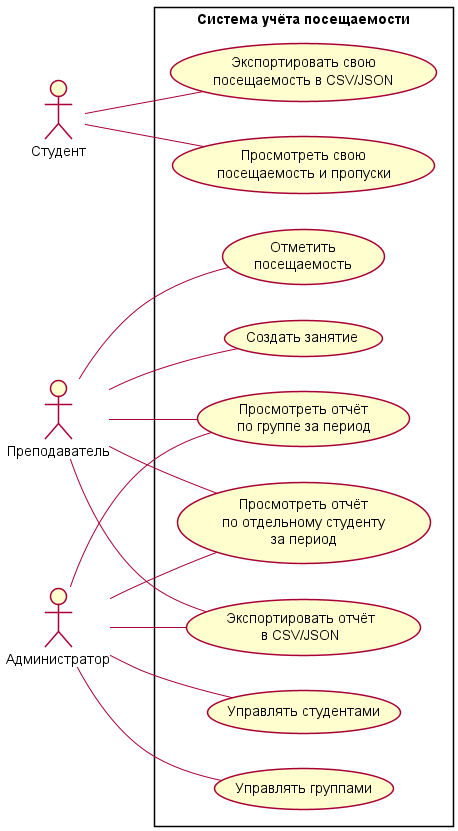

# Система учёта посещаемости студентов

Учебный проект по дисциплине «Информатика».

Автор: Царёв П. В.  
Группа: 26-ИВТ-4-1.

## Описание проекта

Проект посвящён системе учёта посещаемости занятий студентами.

В лабораторной работе №1 определены предметная область,
цели системы, её пользователи и основные функции.
Построены Use Case диаграмма и блок-схемы процессов.

В лабораторной работе №2 подготовлена структура проекта,
добавлена программа на Python и оформлена документация.
Для хранения истории изменений используется Git,
репозиторий размещается на GitHub.

## Текущая реализация

Программа выводит:

- приветствие «Hello, World!»;
- название проекта;
- информацию о лабораторной работе;
- сообщение об успешном запуске.

Функции учёта посещаемости, работа с базой данных
и экспорт отчётов пока являются планируемыми возможностями.

## Предметная область

Система предназначена для учёта посещаемости занятий студентами.

В системе предполагается хранить информацию о:

- студентах;
- учебных группах;
- занятиях;
- фактах присутствия и отсутствия студентов.

Для посещаемости предусмотрены статусы:
«присутствовал», «отсутствовал»,
«уважительная причина».

## Цели системы

1. Автоматизировать отметку посещаемости.
2. Обеспечить хранение и быстрый доступ к данным.
3. Позволить студентам отслеживать свою посещаемость.
4. Формировать отчёты по группе и отдельному студенту за период.
5. Снизить количество ошибок по сравнению с бумажным учётом.

## Пользователи системы

| Пользователь | Планируемые возможности |
|---|---|
| Преподаватель | Создание занятий, отметка посещаемости, просмотр отчётов по своей группе и отдельным студентам, экспорт отчётов |
| Студент | Просмотр и экспорт только собственной посещаемости |
| Администратор | Управление студентами и группами, просмотр и экспорт отчётов по группам и отдельным студентам |

## Планируемые функции

- Добавление и редактирование студентов.
- Добавление и редактирование групп.
- Создание занятия с указанием даты, группы и преподавателя.
- Отметка посещаемости.
- Просмотр студентом своей посещаемости с фильтрацией по дате.
- Формирование отчёта по группе за выбранный период.
- Формирование отчёта по отдельному студенту за выбранный период.
- Экспорт отчётов в CSV или JSON.

## Планируемая архитектура

Для дальнейшей реализации выбрана трёхуровневая архитектура.

| Уровень | Назначение |
|---|---|
| Представление | Консольный интерфейс для пользователя |
| Бизнес-логика | Проверка прав доступа, проверка данных, формирование отчётов |
| Доступ к данным | Хранение данных в SQLite и работа через репозитории |

## Технологии

- Python — язык программирования.
- PyCharm — среда разработки.
- Git — система контроля версий.
- GitHub — размещение репозитория.
- Markdown — оформление документации.
- PlantUML — построение диаграмм.
- SQLite — планируемая база данных.
- CSV и JSON — планируемые форматы экспорта.

## Запуск программы

Для запуска требуется Python 3.
Сторонние библиотеки не нужны.

### Запуск в PyCharm

1. Открыть проект.
2. Выбрать интерпретатор Python.
3. Открыть src/main.py.
4. Нажать правой кнопкой внутри файла.
5. Выбрать Run 'main'.

### Запуск в терминале

Из корневой папки проекта выполнить:

python src/main.py

### Результат запуска

Hello, World!
Система учёта посещаемости студентов
Учебный проект для лабораторной работы №2
Программа успешно запущена.

## Структура проекта

| Путь | Назначение |
|---|---|
| src/main.py | Основной файл программы |
| README.md | Описание проекта |
| .gitignore | Правила исключения служебных файлов |
| docs/diagrams/use_case.puml | Текст Use Case диаграммы |
| docs/diagrams/use_case.png | Изображение Use Case диаграммы |

## Use Case диаграмма

Диаграмма отражает планируемые возможности системы
и взаимодействие её пользователей.

[Исходный текст диаграммы](docs/diagrams/use_case.puml)

## Полезные ссылки

- [Python](https://www.python.org/)
- [Git](https://git-scm.com/)
- [GitHub](https://github.com/)
- [PlantUML](https://plantuml.com/)